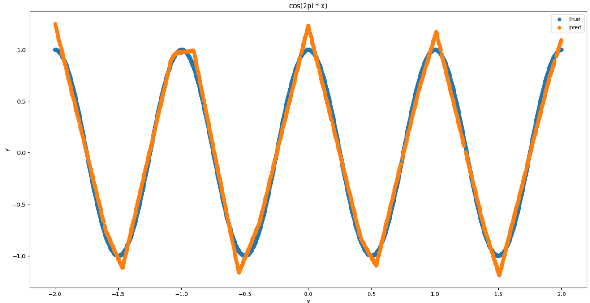

# Multilayer perceptron on CUDA

Just another implementation of multilayer perceptron, but under CUDA architecture.

## Building
For building you need
* C++17
* CUDA 11.3 and greater (with cuBLAS, cuRAND)
* Cmake 3.20 and greater
* (For python interface) Pybind11 (Not finished yet)

Build command
```bash
mkdir build
cd build
cmake -DCMAKE_BUILD_TYPE=RELEASE -DCMAKE_CUDA_COMPILER=/path/to/nvcc -DPYTHON_EXECUTABLE=/path/to/python3.8/with/pybind11 -Dpybind11_DIR=/path/to/pybind11/site-package/share/cmake/pybind11 ..
cmake --build .
```

## Examples
In [demo code directory](demo) contains examples of using Multilayer perceptron on CUDA.
Implemented networks for next functions approximation:
- cos(2 * pi * x)
- x * sin(2 * pi * x)
- 5 * x^3 + x^2 + 5

Full dataset splits to 2 datasets: train and test. Train dataset contains 70% of data,
other - test dataset. Model is trained on train dataset and predict values on test dataset. Predicted values are saved 
in .csv format.

Examples of predicted values:



Run demo:
```bash
mkdir build
cd build
cmake -DCMAKE_BUILD_TYPE=RELEASE -DCMAKE_CUDA_COMPILER=/path/to/nvcc -DPYTHON_EXECUTABLE=/path/to/python3.8/with/pybind11 -Dpybind11_DIR=/path/to/pybind11/site-package/share/cmake/pybind11 ..
cmake --build .
cd demo
./name_of_demo
```